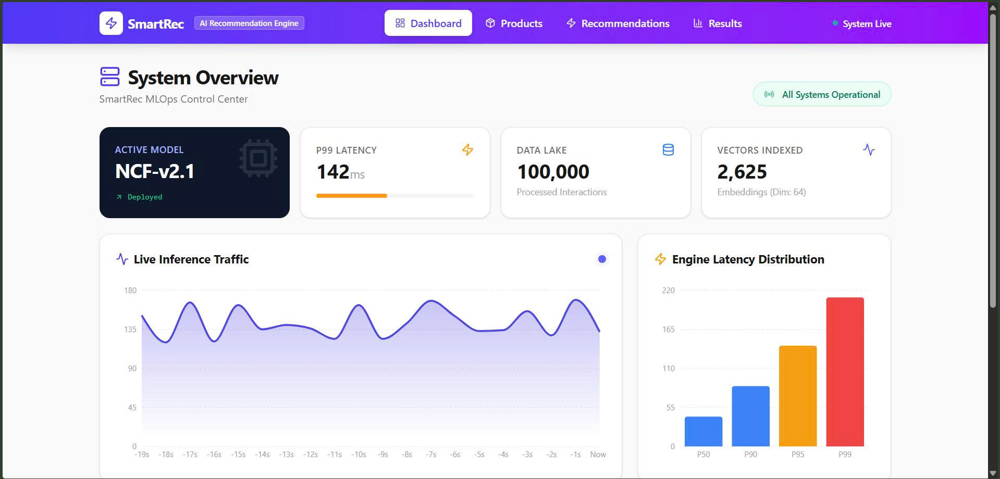
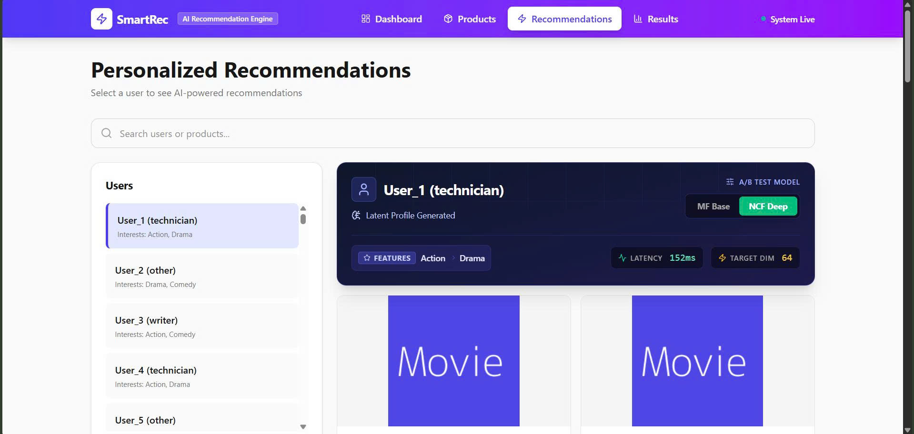

# Smart Recommendation System

An end-to-end recommendation platform for ranking, serving, and analyzing personalized suggestions.

## Key Features
- Deep learning recommendation workflow from training to inference
- Analytics dashboard for monitoring recommendation behavior
- MLOps-ready structure for reproducible experimentation
- Container-friendly deployment workflow

## Tech Stack
- Data Processing: Python, feature preparation pipeline
- Modeling: deep learning ranking models
- Serving: backend inference service
- Frontend: TypeScript, React dashboard
- DevOps: Docker, Docker Compose

## Methodology
- Prepare and transform recommendation datasets
- Train baseline and neural ranking models
- Expose prediction workflow through an inference layer
- Analyze recommendation outputs through dashboard views

## Results
- Built a complete train-to-serve workflow in a single repository
- Established a baseline architecture for experiment tracking and model versioning
- Enabled dashboard-based analysis for recommendation quality and behavior

## Preview
### Dashboard Overview


### Recommendation Interface


## Project Assets
- [Dashboard screenshot](docs/images/dashboard.jpg)
- [Product catalog view](docs/images/products.jpg)
- [Recommendation results view](docs/images/results.jpg)

## Installation
```bash
git clone https://github.com/laninh-tech/Smart-Recommendation-System.git
cd Smart-Recommendation-System
npm install
pip install -r backend/requirements.txt
```